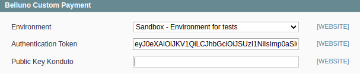
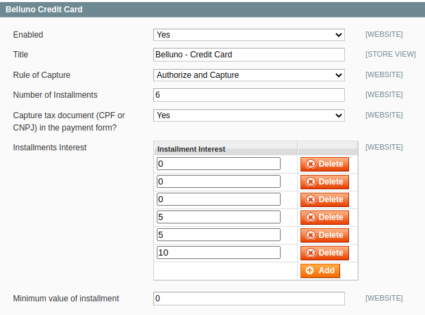
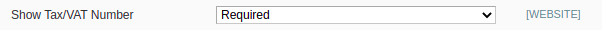
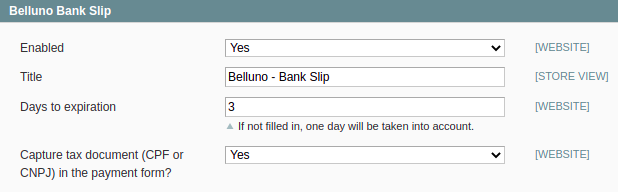
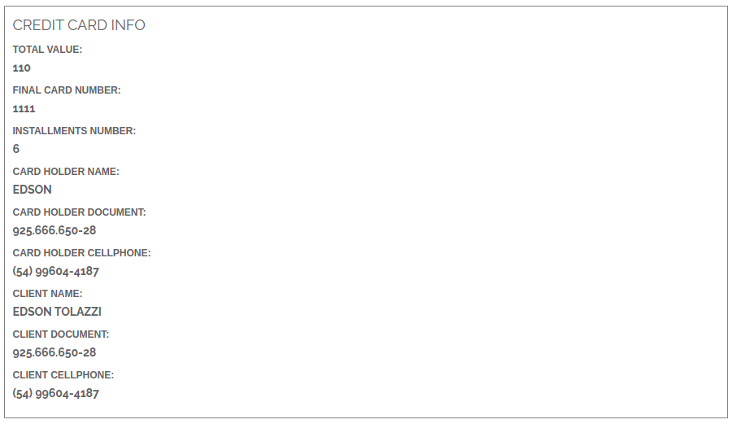
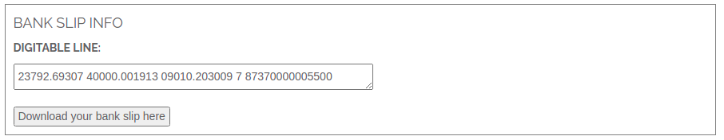
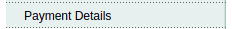
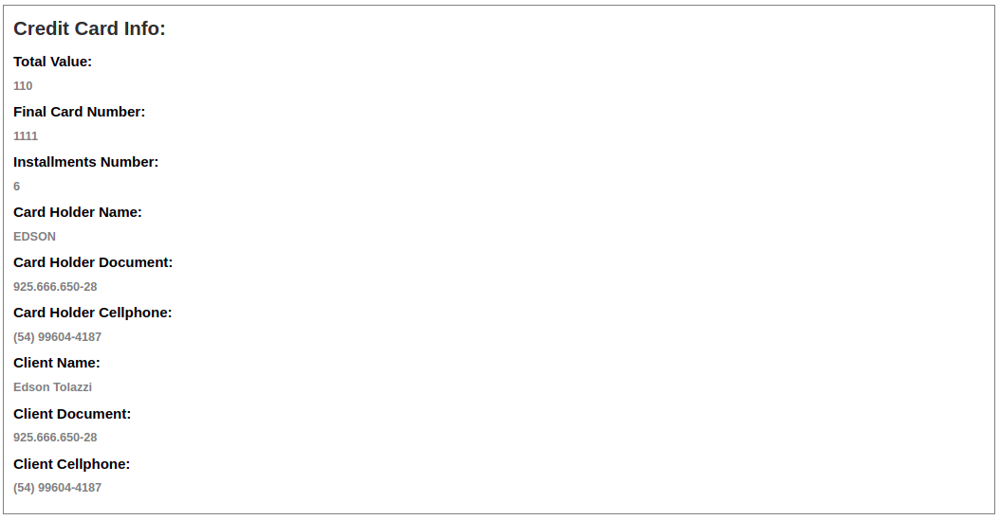
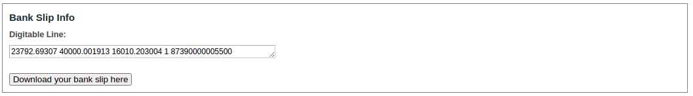

# **[Belluno Payments Integration Module](README.md)**

### *Installation*

------

We recommend that you have a testing environment to validate changes and updates before updating your store in production. Also that all information is backed up before performing any update/installation procedure.

------

### **Compatibility Versions**

*Magento 1.9.4.X & PHP 7.4*

------

### **Installation of Module**

Download the module and follow the steps below:

[Belluno-Magento](https://github.com/tezusecommerce/Belluno_Magento1.9)

#### Installation using GitHub

If your store was created through the clone or download of the magento project, follow the next steps:

1. Download the module.
2. Enter the `Belluno_Magento19` folder and copy **all** the files into the `app` folder of your Magento 1.9 store. 
3. Merge `module` files with `store` files.
4. Enter in folder `code` -> `community` -> `Belluno` and **cut** the `form-belluno.js` file to `skin` -> `frontend` -> `base` -> `default` -> `js`.
5. Enter in folder `code` -> `community` -> `Belluno` and **cut** the folder `images` to `media` -> `belluno`(*create*) -> `magento19`(*create*). 
6. In Magento Administrative Panel, access `system` -> `cache management` -> `click on "select all"` -> `click on "submit"`.
7. In Magento Administrative Panel, access `system` -> `index management` -> `click on "select all"` -> `click on "submit"`.

#### Module Settings

Access the Magento Administrative Panel, click on `system` -> `configuration`, in section `sales` click in **Payment Methods**.

Scroll down until you find `Belluno Custom Payment`, `Belluno Credit Card` and `Belluno Bank Slip`.

So you will have three configurations. *Follow the next steps to understand*.

#### 1 - Belluno Custom Payment

- **Environment:** this option gives the possibility to place the module in a test environment or production environment.
  - `Production` - production environment;
  - `Sandbox` - test environment;
- **Authentication Token:** Belluno support team must provide a valid token for your environment.
- **Public Key Konduto:** this field must be provided by the Konduto support team, but Belluno makes the request to Konduto.  

#### 2 - Belluno Credit Card

- **Enabled:** this option gives the possibility to activate and deactivate the module.

  - `Yes` - activated;
  - `No` - disabled;

- **Title:** in this field you can change the name that will appear at checkout.

- **Rule of Capture:** here you define whether the capture will be automatic or manual.

  - `Authorize` - in this option the captures must be done manually by the administrator. It only authorizes purchases.
  - `Authorize and Capture` - in this option the authorization and capture are done automatically.

- **Number of Installments:** in this field you can configure the maximum number of possible installments.

- **Installments Interest:** here you can add or decrease the amount of installments that will be available. 

  In each installment it is take to put a number that will represent the percentage of interest on the total amount.

  **Observation 1:** the fields *Number of Installments* and *Installments Interest* are **related**, keep them **aligned**.

  **Observation 2:** the ***number*** applied will always add the percentage referring to the ***total amount*** of the order, **NOT** the total amount with interest from the ***previous installment***.

- **Minimum value of installment:** this will be the minimum possible value of a single installment.

- **Capture tax document:** this field allows you to configure whether the client is to fill in your document or not.

  - `Yes` - customer will have to fill in their document at checkout.

  - `No` - customer will not have to fill in their document at checkout.

  - **Observation:** ***IF YOU MARK NO***, you must set the field "***Show Tax/VAT number***" as mandatory.

    - **Show Tax/VAT number:** `System` -> `Configuration` -> `Customers` -> `Customer` `Configuration` -> `Name and Address Options` -> `Show Tax/VAT Number`. **REQUIRED**.

      

#### 3 - Belluno Bank Slip

- **Enabled:** this option gives the possibility to activate and deactivate the module.
  - `Yes` - activated;
  - `No` - disabled;

- **Title:** in this field you can change the name that will appear at checkout.

- **Days to expiration:** number of days for the ticket to expire.

- **Capture tax document:** this field allows you to configure whether the client is to fill in your document or not.

  - `Yes` - customer will have to fill in their document at checkout.

  - `No` - customer will not have to fill in their document at checkout.

  - **Observation:** ***IF YOU MARK NO***, you must set the field "***Show Tax/VAT number***" as mandatory.

    - **Show Tax/VAT number:** `System` -> `Configuration` -> `Customers` -> `Customer` `Configuration` -> `Name and Address Options` -> `Show Tax/VAT Number`. **REQUIRED**.

      

#### Added functions

In **view order frontend**

*For credit card*

*For bank slip*

In **admin page view order**

New section into order: *Payment Details*

*For credit card*

*For bank slip*

